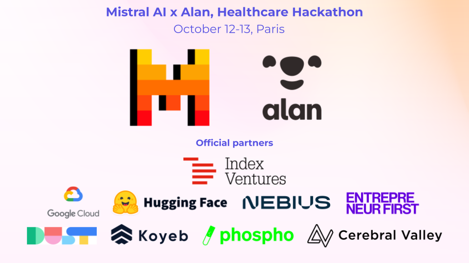

# CardioCare+

This project was developed during the **Mistral AI x Alan Healthcare Hackathon**, where we aimed to develop an AI solution for healthcare. We achieved **second place** 🥈 in the hackathon!

**CardioCare+** is an AI solution that utilizes Mistral's state-of-the-art models. By combining **Pixtral** with a **Mistral Large** model fine-tuned on medical guidelines, we created a system that automatically processes blood test results and provides explanations for cardiovascular patients, offering personalized health insights. 

Our goal is to assist cardiovascular patients with practical advice while they await specialist appointments, which can often take weeks or even months.

Check out our [demo video](https://www.youtube.com/watch?v=zeiR0q6L0x4&ab_channel=NoctuaCare) to see it in action!
